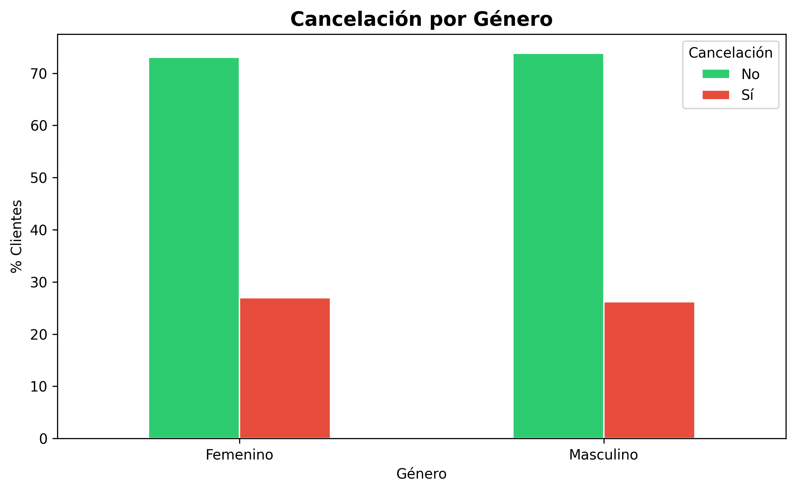
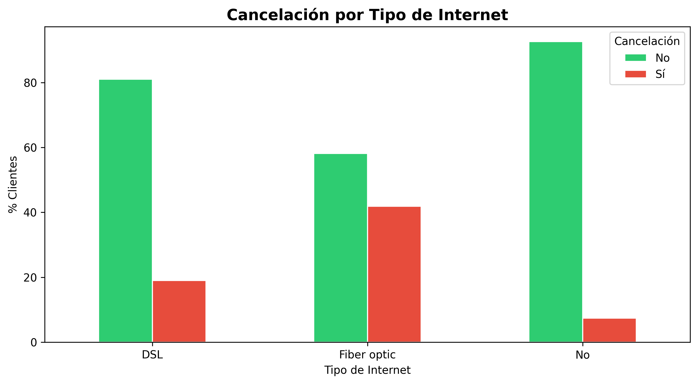
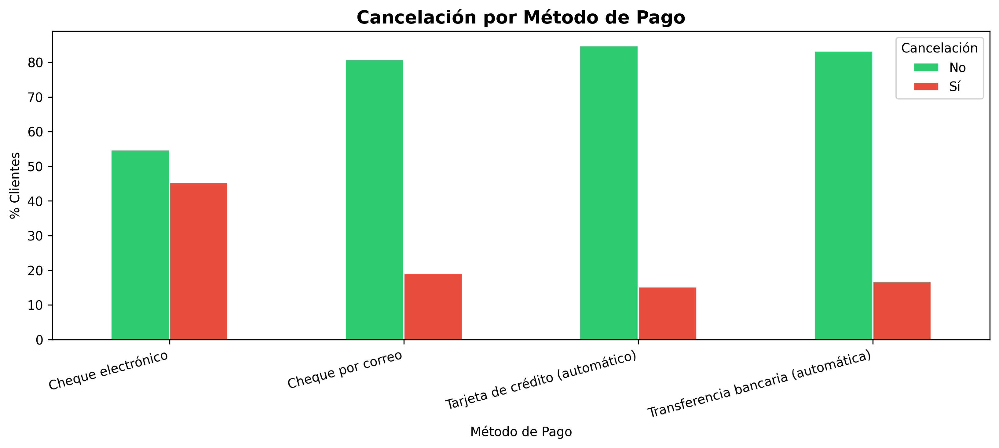

# 📊 TelecomX — Análisis de Cancelación de Clientes (Churn)


---

## 📋 Descripción del Proyecto

TelecomX enfrenta una **tasa de cancelación (churn) del 26.5%** sobre una base de 7,043 clientes. Este proyecto forma parte del **Challenge 2 de Data Science LATAM de Alura** y tiene como objetivo identificar los factores que llevan a la pérdida de clientes mediante un análisis exploratorio de datos completo.

A partir de los hallazgos, el equipo de Data Science podrá avanzar en la construcción de modelos predictivos y el negocio podrá desarrollar estrategias concretas para mejorar la retención.

### 🎯 Objetivos
- Extraer y procesar datos desde una API en formato JSON
- Aplicar el proceso ETL completo (Extracción, Transformación y Carga)
- Traducir y estandarizar columnas y valores al español
- Realizar un Análisis Exploratorio de Datos (EDA)
- Identificar patrones y factores de riesgo de cancelación
- Generar insights y recomendaciones estratégicas

---

## 🛠️ Tecnologías Utilizadas

| Herramienta | Uso |
|---|---|
| `Python 3.10+` | Lenguaje principal |
| `Pandas` | Manipulación y análisis de datos |
| `NumPy` | Operaciones numéricas |
| `Matplotlib` | Visualización de datos |
| `Seaborn` | Visualización estadística |
| `Requests` | Consumo de API |
| `Google Colab` | Entorno de ejecución |

---

## 🚀 Cómo Ejecutar el Proyecto

### Opción 1 — Google Colab (recomendado)

1. Abre [Google Colab](https://colab.research.google.com/)
2. Ve a **Archivo → Subir notebook**
3. Sube el archivo `TelecomX_LATAM.ipynb`
4. Ejecuta todas las celdas en orden con **Runtime → Run all**

> ✅ No requiere instalación adicional. Todas las librerías están disponibles en Colab.

### Opción 2 — Entorno local

```bash
# 1. Clona el repositorio
git clone https://github.com/jealpahu/telecomx-churn-analysis.git
cd telecomx-churn-analysis

# 2. Instala las dependencias
pip install pandas numpy matplotlib seaborn requests

# 3. Abre el notebook
jupyter notebook TelecomX_LATAM.ipynb
```

---

## 📁 Estructura de Archivos

```
telecomx-churn-analysis/
│
├── data/
│   └── TelecomX_Data.json     # Dataset original
├── img/                       # Capturas de los gráficos generados
│   ├── churn_distribution.png
│   ├── churn_by_genero.png
│   ├── churn_by_contract.png
│   ├── churn_by_internet.png
│   ├── churn_by_payment.png
│   └── churn_by_tenure.png
├── TelecomX_LATAM.ipynb       # Notebook principal con todo el análisis
└── README.md                  # Documentación del proyecto
```

---

## 📊 Capturas de Gráficos

> Los gráficos se generan automáticamente al ejecutar el notebook.

### 1. Distribución de Cancelación

Proporción de clientes que cancelaron (26.5%) vs. los que permanecieron (73.5%).

---

### 2. Cancelación por Género

La cancelación es similar entre géneros, sin diferencias significativas.

---

### 3. Cancelación por Tipo de Contrato

Los clientes con contrato **mes a mes** tienen una tasa de cancelación del 42.7%, muy por encima de la media global.

---

### 4. Cancelación por Tipo de Internet

Los clientes con **Fibra Óptica** presentan mayor cancelación que los de DSL a pesar de ser el servicio premium.

---

### 5. Cancelación por Método de Pago

El **cheque electrónico** es el método de pago con mayor tasa de cancelación.

---

### 6. Cancelación por Antigüedad

Los clientes con **pocos meses** de contrato concentran la mayor tasa de cancelación (~47.7%).

---

## 💡 Principales Hallazgos

- 🔴 **Contrato mes a mes** → tasa de cancelación del ~42.7%, el factor más crítico
- 🔴 **Primeros 12 meses** → ~47.7% de cancelación, etapa crítica de onboarding
- 🟠 **Cargo mensual elevado** → clientes que se van pagan ~$74/mes vs ~$61/mes los que permanecen
- 🟠 **Fibra óptica** → mayor cancelación que DSL a pesar de ser el servicio premium
- 🟡 **Cheque electrónico** → método de pago con mayor tasa de cancelación
- 🟡 **Adultos mayores** → tasa de cancelación superior al promedio

---

## 📬 Autor y Contacto

**Jesús Alberto Palet Huerta**

[](https://github.com/jealpahu)
[](https://www.linkedin.com/in/jealpahu/)
[](mailto:jealpahu@gmail.com)

---

*Proyecto desarrollado como parte del Challenge 2 — Data Science LATAM | Alura* 🚀
