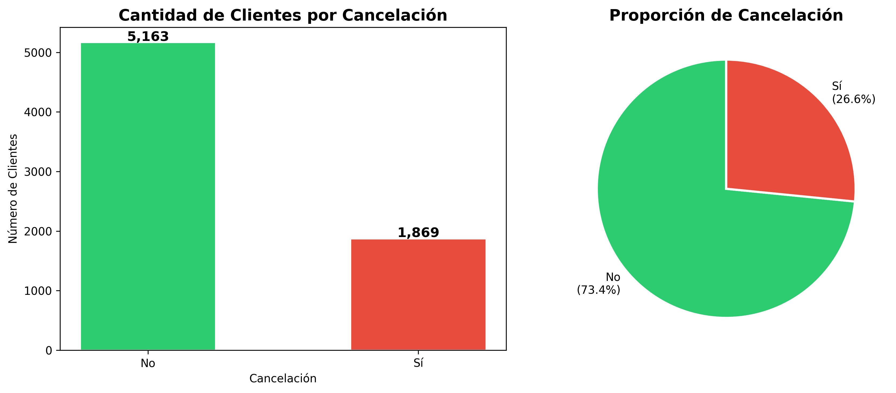
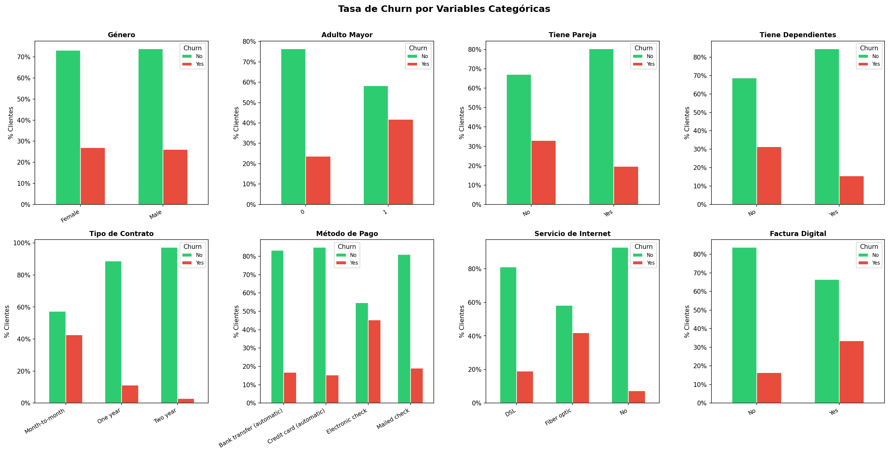
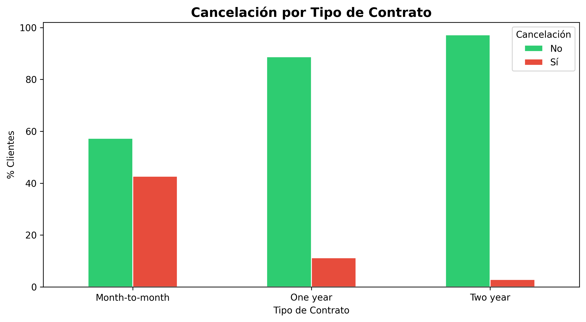
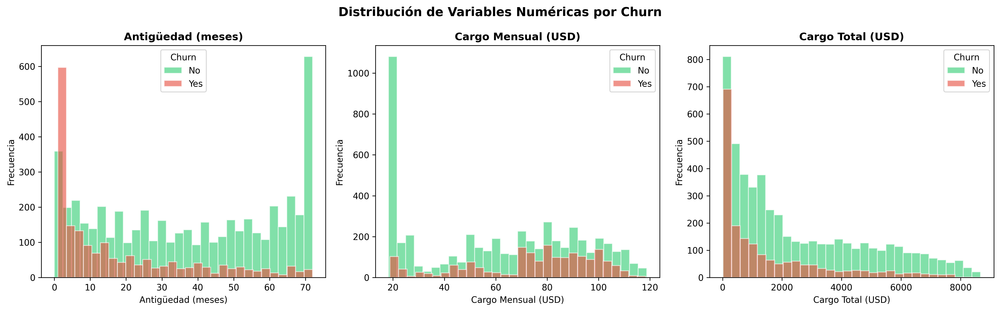
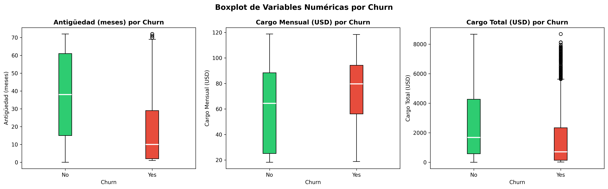
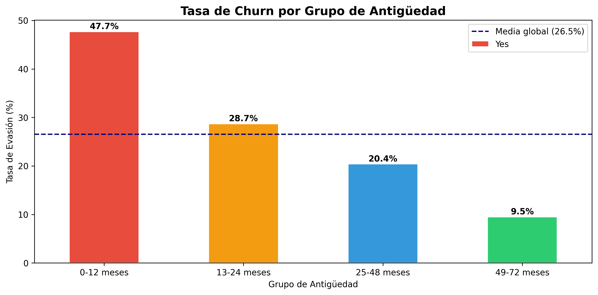
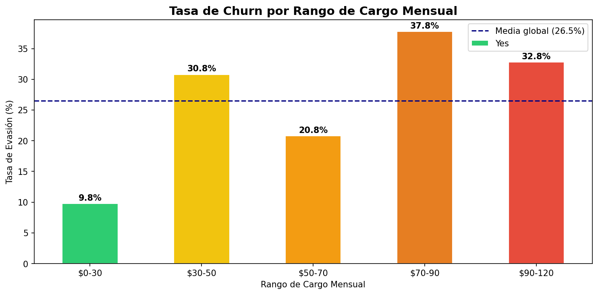
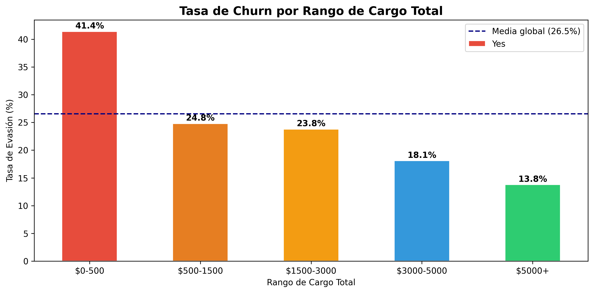
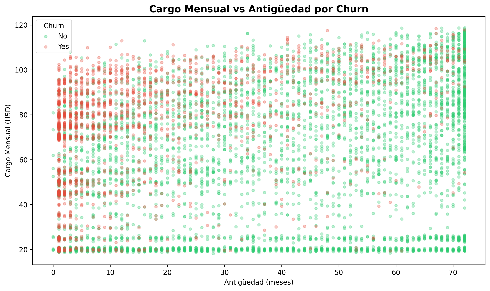
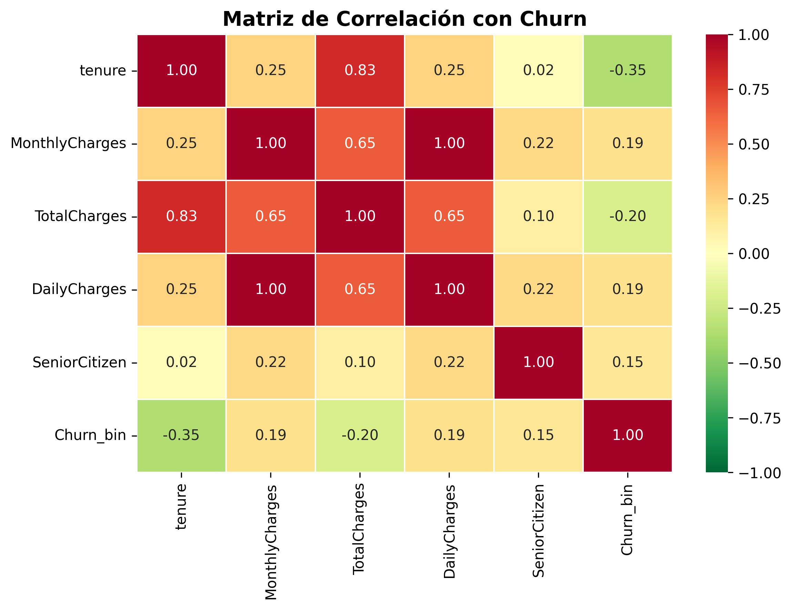

# 📊 TelecomX — Análisis de Evasión de Clientes (Churn)


---

## 📋 Descripción del Proyecto

TelecomX enfrenta una **tasa de evasión (churn) del 26.5%** sobre una base de 7,043 clientes. Este proyecto forma parte del **Challenge 2 de Data Science LATAM de Alura** y tiene como objetivo identificar los factores que llevan a la pérdida de clientes mediante un análisis exploratorio de datos completo.

A partir de los hallazgos, el equipo de Data Science podrá avanzar en la construcción de modelos predictivos y el negocio podrá desarrollar estrategias concretas para mejorar la retención.

### 🎯 Objetivos
- Extraer y procesar datos desde una API en formato JSON
- Aplicar el proceso ETL completo (Extracción, Transformación y Carga)
- Realizar un Análisis Exploratorio de Datos (EDA)
- Identificar patrones y factores de riesgo de churn
- Generar insights y recomendaciones estratégicas

---

## 🛠️ Tecnologías Utilizadas

| Herramienta | Uso |
|---|---|
| `Python 3.10+` | Lenguaje principal |
| `Pandas` | Manipulación y análisis de datos |
| `NumPy` | Operaciones numéricas |
| `Matplotlib` | Visualización de datos |
| `Seaborn` | Visualización estadística |
| `Requests` | Consumo de API |
| `Google Colab` | Entorno de ejecución |

---

## 🚀 Cómo Ejecutar el Proyecto

### Opción 1 — Google Colab (recomendado)

1. Abre [Google Colab](https://colab.research.google.com/)
2. Ve a **Archivo → Subir notebook**
3. Sube el archivo `TelecomX_LATAM.ipynb`
4. Ejecuta todas las celdas en orden con **Runtime → Run all**

> ✅ No requiere instalación adicional. Todas las librerías están disponibles en Colab.

### Opción 2 — Entorno local

```bash
# 1. Clona el repositorio
git clone https://github.com/jealpahu/TelecomX_LATAM.git
cd TelecomX_LATAM

# 2. Instala las dependencias
pip install pandas numpy matplotlib seaborn requests

# 3. Abre el notebook
jupyter notebook TelecomX_LATAM.ipynb
```

---

## 📁 Estructura de Archivos

```
TelecomX_LATAM/
│
├── TelecomX_LATAM.ipynb   # Notebook principal con todo el análisis
├── README.md              # Documentación del proyecto
└── img/                   # Capturas de los gráficos generados
    ├── churn_distribution.png
    ├── churn_by_contract.png
    ├── churn_by_categorical.png
    ├── churn_by_tenure.png
    └── correlation_matrix.png
```

---

## 📊 Capturas de Gráficos

> Los gráficos se generan automáticamente al ejecutar el notebook.

### 1. Distribución de Churn

Proporción de clientes que cancelaron (26.5%) vs. los que permanecieron (73.5%).

---

### 2. Tasa de Churn por Variables Categóricas

Análisis de evasión por género, adulto mayor, pareja, dependientes, tipo de contrato, método de pago, servicio de internet y factura digital.

---

### 3. Tasa de Churn por Tipo de Contrato

Los clientes con contrato **mes a mes** tienen una tasa de churn del 42.7%, muy por encima de la media global.

---

### 4. Distribución de Variables Numéricas por Churn

Histogramas de antigüedad, cargo mensual y cargo total segmentados por churn.

---

### 5. Boxplot de Variables Numéricas por Churn

Los clientes que se van tienen menor antigüedad y mayor cargo mensual que los que permanecen.

---

### 6. Tasa de Churn por Grupo de Antigüedad

Los clientes con **0-12 meses** presentan la mayor tasa de evasión (47.7%), decreciendo a medida que aumenta la antigüedad.

---

### 7. Tasa de Churn por Rango de Cargo Mensual

Los clientes con cargos entre **$70-90/mes** presentan la mayor tasa de evasión (37.8%).

---

### 8. Tasa de Churn por Rango de Cargo Total

Los clientes con menor gasto acumulado (**$0-500**) son los más propensos a cancelar (41.4%).

---

### 9. Cargo Mensual vs Antigüedad por Churn

Zona de alto riesgo identificada: clientes con **baja antigüedad y alto cargo mensual**.

---

### 10. Matriz de Correlación con Churn

La **antigüedad** tiene correlación negativa con churn (-0.35), mientras que los **cargos mensuales** tienen correlación positiva (0.19).

---

## 💡 Principales Hallazgos

- 🔴 **Contrato mes a mes** → tasa de churn del ~42.7%, el factor más crítico
- 🔴 **Primeros 12 meses** → ~47% de evasión, etapa crítica de onboarding
- 🟠 **Cargo mensual elevado** → clientes que se van pagan ~$74/mes vs ~$61/mes los que permanecen
- 🟠 **Fibra óptica** → mayor churn que DSL a pesar de ser el servicio premium
- 🟡 **Cheque electrónico** → método de pago con mayor tasa de evasión
- 🟡 **Adultos mayores** → tasa de churn superior al promedio

---

## 📬 Autor y Contacto

**Jesús Alberto Palet Huerta**

[](https://github.com/jealpahu)
[](https://www.linkedin.com/in/jealpahu/)
[](mailto:jealpahu@gmail.com)

---

*Proyecto desarrollado como parte del Challenge 2 — Data Science LATAM | Alura* 🚀
